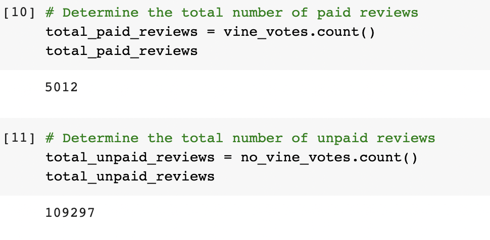
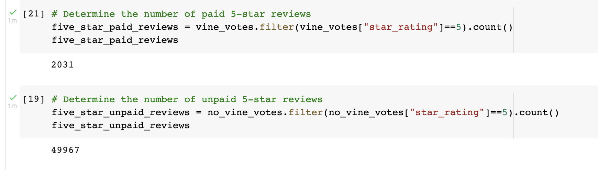
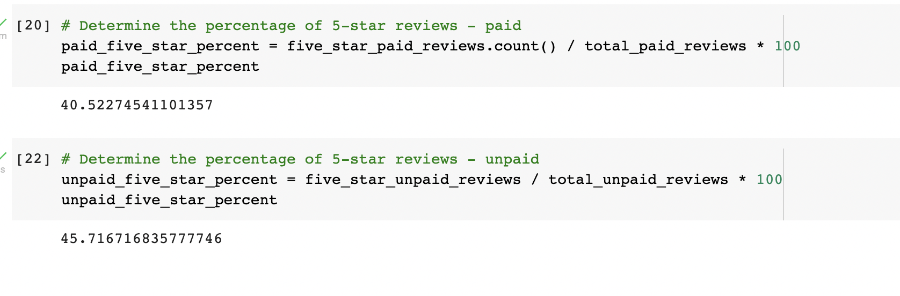

# Amazon Vine Analysis
## Overview
 Amazon Vine is an invitation-only program where reviewers receive free items in exchange for product reviews. Vine reviews have a disclaimer on the Amazon website for transparency. This project aims to confirm there is no positive product review bais for these types of paid reviews. The [analysis](Vine_Review_Analysis.ipynb) was performed in Google Colaboratory with PySpark and output as a ipynb.
## Results
### How many Vine Reviews and Non-Vine Reviews were there?
This [dataset](https://s3.amazonaws.com/amazon-reviews-pds/tsv/amazon_reviews_us_Books_v1_00.tsv.gz) of Amazon reviews in the Books product category. The schema includes:
- marketplace
- customer id
- review id
- product id
- book title
- star rating
- helpful votes
- total votes 
- vine designation 
- review inforamtion

To clean the dataset, I first filtered the data to include items where the total_votes >= 20 votes, and the helpful votes to total votes ratio was >= 50%.

Then I created two new dataframes that filter for Vine votes, to have two separate datasets for paid reviews and unpaid reviews. A simple count function of each dataframe shows the number of vine reviews (paid) and non-vine reviews (unpaid).

### How many Vine reviews were 5 stars? How many non-Vine reviews were 5 stars?
Filtering each dataset by the "star_rating" column, reveals the number of 5 star reviews for each group.

### What percentage of Vine reviews were 5 stars? What percentage of non-Vine reviews were 5 stars?
Comparing the percentage of 5-star reviews as a part of the whole gives us a better idea how many reveiws are 5 star across both groups (even with smaller population sizes).

## Summary
There is no strong positivity bias for reveiws in the Vine program in the books category. 40.52% of Vine reviews were 5 stars, and 45.71% of unpaid reviews were rated 5 stars. One additional analysis to further confirm would be to compare the rating of the other star reviews to see if a similiar distribution of data or any skewing of the data.
